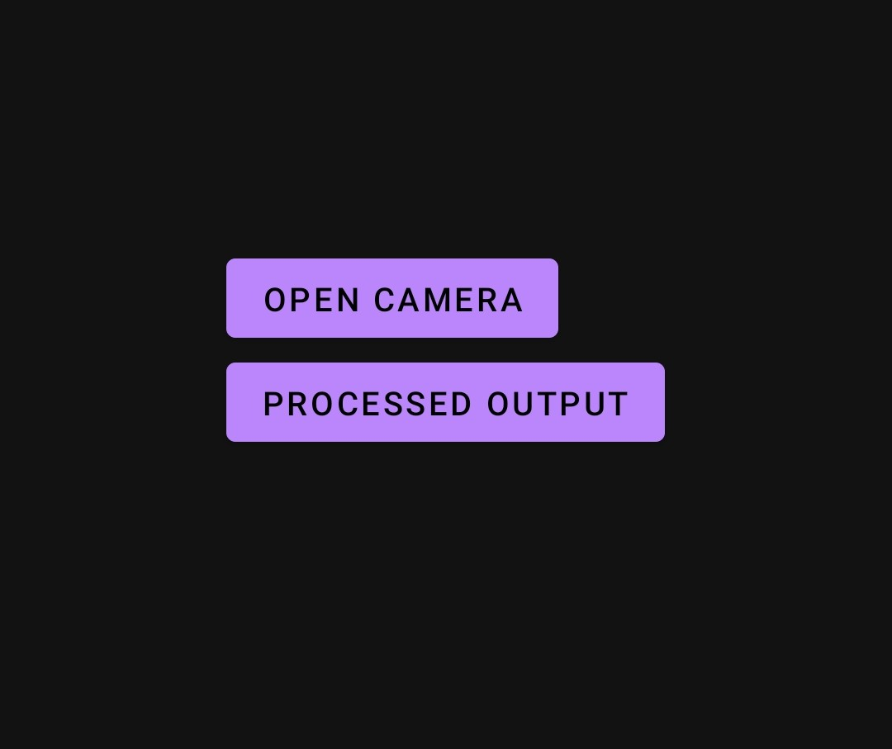
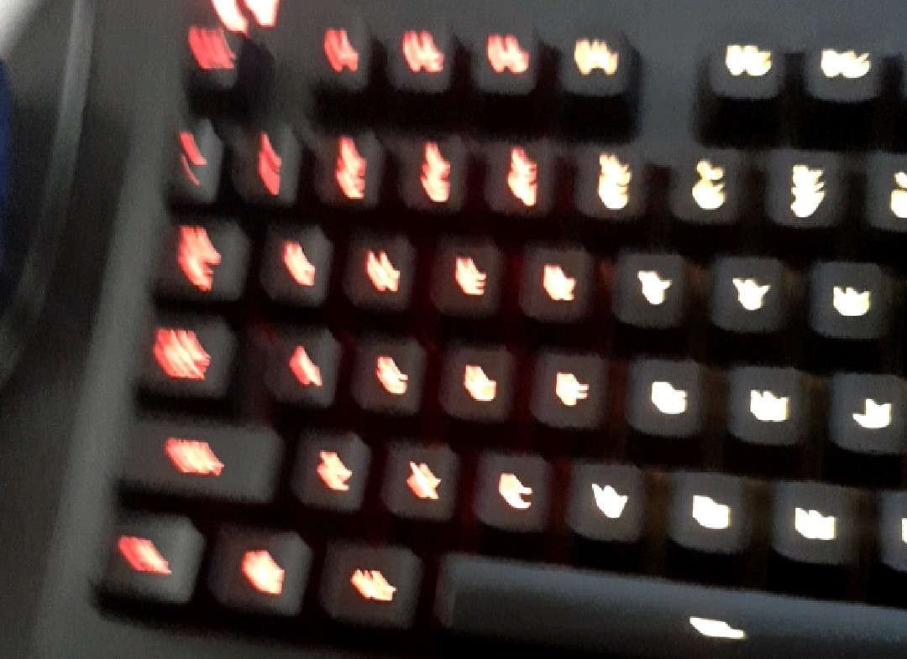
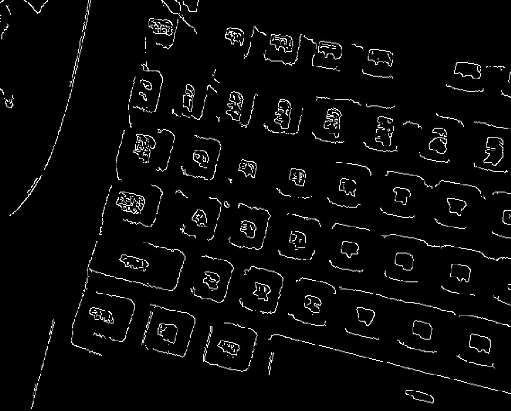

Your pasted README broke because Markdown code blocks weren’t closed properly.

Here is your **fixed, clean, properly formatted README**, including the missing code blocks and formatting.

Just **copy–paste this entire thing into your README.md** — it will render perfectly.

---

````md
# 📱 Real-Time Edge Detection Viewer

A fast Android-based real-time camera processing application built using **Java**, **OpenCV (C++)**, and **OpenGL ES**.  
The app provides two modes when launched:

- **Open Camera** → Default camera preview  
- **Show Processed Output** → Real-time **Canny Edge Detection** display

---

## 🚀 Features

### 🎥 Camera & Rendering
- Real-time camera feed using **Camera2 API**
- Smooth rendering with **OpenGL ES 2.0**
- One-click toggle between **Raw View** and **Processed View**

### 🧠 Image Processing (C++ / OpenCV)
- High-speed **Canny Edge Detection**
- Grayscale processing
- YUV → Mat → RGBA frame conversion
- FPS & performance timing logs
- YUV → Mat → RGBA frame conversion
- FPS & performance timing logs

### 🔗 Architecture Highlights
- **Java/Kotlin Layer** → Handles Camera2 + UI  
- **JNI Bridge** → Transfers frames to native C++  
- **OpenCV C++ Layer** → Performs image processing  
- **OpenGL ES Renderer** → Displays processed texture in real time
- **Java/Kotlin Layer** → Handles Camera2 + UI  
- **JNI Bridge** → Transfers frames to native C++  
- **OpenCV C++ Layer** → Performs image processing  
- **OpenGL ES Renderer** → Displays processed texture in real time

---

## 🖼️ Screenshots

| Home Page | Raw Image | Processed Image |
|-----------|-----------|-----------------|
|  |  |  |

---

## ⚙️ Setup & Installation

### 1️⃣ Prerequisites
- Android Studio Arctic Fox or newer  
- Android NDK (r21 or above)  
- OpenCV Android SDK (version 4.x recommended)
- Android NDK (r21 or above)  
- OpenCV Android SDK (version 4.x recommended)

---

### 2️⃣ Clone This Repository
```bash
git clone https://github.com/Untolders/Real_Time_Edge_Detection.git
cd Real_Time_Edge_Detection
````

---

### 3️⃣ Integrate OpenCV Android SDK

Download the OpenCV Android SDK from the official OpenCV website.

Extract the SDK and place it in:

```
app/src/main/jniLibs/OpenCV/


Update your `CMakeLists.txt`:

```cmake
set(OpenCV_DIR ${CMAKE_SOURCE_DIR}/src/main/jniLibs/OpenCV/sdk/native/jni)
find_package(OpenCV REQUIRED)
include_directories(${OpenCV_INCLUDE_DIRS})
target_link_libraries(
    native-lib
    ${OpenCV_LIBS}
)
```

---

### 4️⃣ Build & Run the Application

#### Using Android Studio

* Enable **NDK + CMake** from *Preferences → SDK Tools*
* Connect an Android device with a camera
* Click **Run**

#### Using the command line

```bash
./gradlew assembleDebug
```

---

## 🧠 Architecture Overview (Layer-wise)

### **Java/Kotlin Layer**

* Uses Camera2 API
* Streams frames into a `TextureView`
* Sends each frame to native C++ through JNI

### **JNI Bridge**

* Converts Java byte array → `cv::Mat`
* Calls native C++ `processFrame()`
* Sends processed RGBA back to Java

### **OpenCV C++ Layer**

* Converts YUV → Grayscale
* Applies **Canny Edge Detection**
* Outputs RGBA for OpenGL ES

### **OpenGL ES Renderer**

* Draws textures in real-time
* Maintains smooth performance (15–30 FPS depending on device)


git clone https://github.com/Untolders/Real_Time_Edge_Detection.git
cd Real_Time_Edge_Detection
````

---

### 3️⃣ Integrate OpenCV Android SDK

Download the OpenCV Android SDK from the official OpenCV website.

Extract the SDK and place it in:

```
app/src/main/jniLibs/OpenCV/
```

Update your `CMakeLists.txt`:

```cmake
set(OpenCV_DIR ${CMAKE_SOURCE_DIR}/src/main/jniLibs/OpenCV/sdk/native/jni)
find_package(OpenCV REQUIRED)
include_directories(${OpenCV_INCLUDE_DIRS})
target_link_libraries(
    native-lib
    ${OpenCV_LIBS}
)
```

---

### 4️⃣ Build & Run the Application

#### Using Android Studio

* Enable **NDK + CMake** from *Preferences → SDK Tools*
* Connect an Android device with a camera
* Click **Run**

#### Using the command line

```bash
./gradlew assembleDebug
```

---

## 🧠 Architecture Overview (Layer-wise)

### **Java/Kotlin Layer**

* Uses Camera2 API
* Streams frames into a `TextureView`
* Sends each frame to native C++ through JNI

### **JNI Bridge**

* Converts Java byte array → `cv::Mat`
* Calls native C++ `processFrame()`
* Sends processed RGBA back to Java

### **OpenCV C++ Layer**

* Converts YUV → Grayscale
* Applies **Canny Edge Detection**
* Outputs RGBA for OpenGL ES

### **OpenGL ES Renderer**

* Draws textures in real-time
* Maintains smooth performance (15–30 FPS depending on device)

---

## 📜 License

This project is licensed under the **MIT License**.
Feel free to modify, extend, and share.

```

---

If you want, I can also:

✅ Add GitHub badges (MIT, Stars, Forks, Issues, Android, OpenCV)  
✅ Add a GIF demo inside the README  
✅ Add installation troubleshooting  

Just tell me!
```
